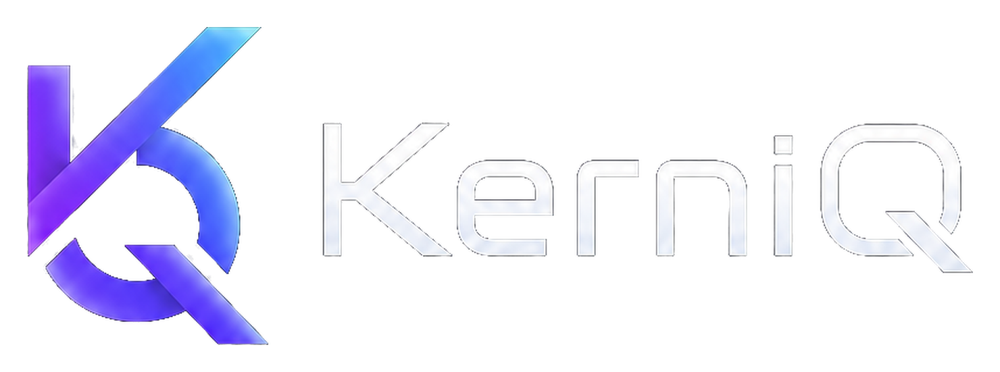

# KerniQ

<p align="center">
  
</p>

**English** | [中文](README.zh-CN.md)

> Desktop-first, multi-model, skill-enabled, MCP-compatible, diff-first AI coding agent.

**Codex Workflow, Any Model, Skills Included.**

KerniQ was previously known as Qodex. Releases up to and including
v0.2.0-beta.1 may still reference the Qodex name.


-purple)

[](https://github.com/MkaliezZ/qodex/actions/workflows/ci.yml)


---

## What is KerniQ?

KerniQ is an AI coding agent that follows the Codex workflow philosophy while remaining **provider-agnostic**. Unlike tools locked to a single model vendor, KerniQ supports OpenAI, DeepSeek, OpenRouter, and any OpenAI-compatible endpoint through a unified Provider SDK.

**Why KerniQ?** Existing AI coding tools (Codex, Cursor, Claude Code) are typically tied to specific models. KerniQ decouples the coding workflow from any single provider — you can switch models without changing your workflow.

**Key architectural differences:**

| vs Codex | vs Cursor | vs Claude Code |
|:--|:--|:--|
| Multi-provider SDK | Modular 9-package architecture | Permissive MIT license |
| Independent Skill Runtime | Dedicated MCP Runtime | Multi-Agent orchestration |
| Formal Context Engine | Diff Engine with rollback | Git Checkpoint system |

---

## Features

| Feature | Description |
|:--|:--|
| **Provider SDK** | Unified interface for OpenAI, DeepSeek, OpenRouter, and custom endpoints |
| **Context Engine** | Structured prompt assembly: Rules → Memory → Skills → Metadata → Files → Task |
| **Agent Runtime** | Task lifecycle with streaming, cancellation, and event bus |
| **Session Runtime** | Append-only local session history, deterministic projection, and approval-safe restart recovery |
| **Action Runtime** | Proposal/approval/decision/outcome contracts with a durable pre-dispatch barrier |
| **Managed Python** | User-installed private CPython runtime for the pinned canonical AgentFuse proof bridge |
| **Diff Engine** | User-approved patches for selected local text files, with stale-content checks, verified writes, and session rollback |
| **Git Runtime** | Checkpoints, commits, branches, restore — no Git knowledge required |
| **Skill Runtime** | Domain-specific guidelines via markdown skills, keyword resolution |
| **MCP Runtime** | External tool discovery with permission-gated execution |
| **Multi-Agent Runtime** | Coordinator + 4 specialists (Review, Refactor, Research, Testing) |
| **Project Runtime** | Open local projects, build file trees, read and select files |

---

## Architecture

```
User Input → ContextEngine → MultiAgentRuntime → AgentRuntime → Provider SDK
               ↓                  ↓                   ↓
             Skills             Planner            Streaming
             Memory          Review/Refactor/         ↓
            Metadata       Research/Testing       DiffEngine
              Files            Agents            Patch Proposal
                                 ↓                   ↓
                             Aggregated          Apply/Reject
                               Report                ↓
                                                  Git Checkpoint
```

---

## Repository Structure

```
qodex/                  ← legacy repository name
├── apps/desktop/           ← Tauri + React desktop UI
├── packages/
│   ├── provider-sdk/         ← Model provider abstraction (35 tests)
│   ├── agent-runtime/        ← Task execution orchestration (50 tests)
│   ├── session-runtime/      ← Universal session ledger and recovery
│   ├── project-runtime/      ← File system access (41 tests)
│   ├── context-engine/       ← Context assembly pipeline (57 tests)
│   ├── diff-engine/          ← Patch generation & apply (95 tests)
│   ├── git-runtime/          ← Git operations & checkpoints (123 tests)
│   ├── planning-runtime/     ← Task planning & dependencies (105 tests)
│   ├── execution-graph-runtime/ ← Graph-based execution (78 tests)
│   ├── i18n-runtime/         ← Internationalization (35 tests)
│   ├── marketplace-runtime/  ← Skill marketplace & registry (85 tests)
│   ├── skill-runtime/        ← Skill loading & resolution (131 tests)
│   ├── mcp-runtime/          ← MCP tool management (160 tests)
│   └── multi-agent-runtime/  ← Multi-agent orchestration (195 tests)
├── docs/                   ← Specifications, guides, development logs
└── qodex-config/           ← AI agent workspace (rules, memory, ADRs, skills)
```

> **Legacy compatibility:** The `@qodex/*` package scope, `qodex-config/`, and
> related persisted identifiers remain unchanged during the KerniQ brand
> migration to avoid breaking existing integrations and local data.

---

## Quick Start

```bash
# Requirements: Node.js 18+, pnpm 9+
pnpm install
cd apps/desktop && pnpm dev
```

Open http://localhost:1420.

Full guide: [QUICK_START.md](docs/QUICK_START.md)

---

## Test Suite

```bash
pnpm -r test
```

**1,605 tests** across 18 tested workspace projects - all passing.

## Minimal Agent Loop v0.4

KerniQ can run a bounded multi-turn coding-agent loop with verified
OpenAI-compatible providers. Agent Mode can search eligible project text,
read bounded file ranges, propose existing-file patches, and return approved
project test results to the model for a limited failure-to-fix iteration.

Two separate approval boundaries remain mandatory:

- Source changes use `KERNIQ_PATCH_V1`, an exact Diff Viewer, explicit Apply or
  Reject, stale-content checks, and write readback verification.
- Project commands must come from the trusted `package.json` or Cargo catalog.
  Every execution displays the exact executable, arguments, relative working
  directory, and source before a one-time Approve or Deny decision.

Applied patches are retained in per-task memory so the latest patch or all task
patches can be rolled back in reverse order with conflict and readback checks.

Agent Mode is deliberately constrained. Cataloged project scripts are not an OS
sandbox and may have side effects. KerniQ does not provide an arbitrary terminal,
automatic approval, new-file creation, file deletion, automatic Git commits,
MCP tools, or persistent task history in v0.4. Native command execution is
desktop-only; browser mode keeps read tools, approved patches, and rollback but
returns an explicit unsupported result for commands. Tool-agent support is
limited to verified OpenAI-compatible providers and models.

## Real Patch Loop v0.3

KerniQ supports a first real model-to-file patch loop for selected existing local
text files. A configured model may return a versioned `KERNIQ_PATCH_V1` proposal;
KerniQ parses and validates it, shows the generated unified diff, and writes only
after explicit approval. Applied changes are re-read for verification and can be
rolled back to their exact original contents during the current app session.

This flow is approval-driven, not autonomous. It does not create or delete files
or persist rollback data across app restarts.

In Tauri desktop mode, KerniQ uses the native directory dialog and grants file
access only to the project directory selected for that session. Browser
development mode keeps the File System Access API fallback. Both modes replace
only selected existing text files through the same Diff Engine approval flow.
Project selection and rollback history are not persisted across restarts, and
installer artifacts are not yet published.

---

## Documentation

| Document | Description |
|:--|:--|
| [Quick Start](docs/QUICK_START.md) | Get running in 10 minutes |
| [Installation](docs/INSTALLATION.md) | Setup for macOS / Windows / Linux |
| [Architecture](docs/ARCHITECTURE.md) | Deep dive into all 14 packages |
| [Dev Log](docs/development/DEVLOG.md) | Complete development history |
| [Product Roadmap](docs/development/PRODUCT_ROADMAP.md) | Authoritative product and distribution milestones |
| [ADR Records](qodex-config/adr/) | Architecture Decision Records |
| [Release Notes](docs/development/RELEASE_NOTES_v0.2.0-beta.2.md) | v0.2.0-beta.2 changelog |

---

## Session Restart Safety v0.5.1

Mutating Agent actions use a durable pre-dispatch receipt: patch writes and
cataloged commands start only after fresh approval evidence and a started event
have committed to the local session ledger. A restart with started-but-unsettled
evidence is shown as `Interrupted`; KerniQ does not replay it or offer another
approval. Pending actions that never started require project reauthorization
and a new approval generation.

Session persistence and redacted export apply bounded local scanning for
recognised credential and absolute-path patterns. Sensitive patch contents are
not retained for recovery. This is defense in depth and does not claim to detect
every possible secret.

## Settlement Evidence Honesty v0.5.2

KerniQ distinguishes persistence failure before dispatch from failure to record
the final outcome after dispatch. If approval or started evidence cannot be
committed, the filesystem write or command process does not start. If dispatch
has started but its settlement evidence cannot be committed, the Session becomes
`Interrupted` with an unknown physical outcome, or retains the unmatched started
receipt for recovery to classify the same way.

An ordinary completed, failed, cancelled, or limit-reached Session event cannot
hide a started-but-unsettled action. Recovery checks that evidence before trusting
a cached terminal status. KerniQ does not replay or reapprove the action and does
not continue the provider. SQLite evidence and external filesystem or process
side effects are not transactionally atomic, so the product deliberately avoids
inventing whether the physical operation completed.

## Managed Python and AgentFuse Foundation v0.6.0

KerniQ can explicitly install and verify a private CPython runtime without
changing system Python or a project environment. The v0.6.0 bridge pins the
canonical DHMS AgentFuse source and uses it for one development-only bounded
counter proof. AgentFuse allow is a pre-dispatch policy decision, not an
execution-success claim. Patch and Command behavior is unchanged and is not
routed through AgentFuse in this milestone.

The v0.6.0.1 correction validates every approval, decision, started receipt,
and outcome before dispatch or settlement. A durable `ACTION_DECIDED` record
precedes every generic Action dispatch. If terminal evidence cannot be
committed after a handler runs, the Action is `Interrupted` with an unknown
physical outcome and is not replayed. Managed runtime verification compares
all installed trees with compile-time trusted digests, and the bridge uses the
public DHMS AgentFuse 3.6.0 `evaluate()` API under one 15-second bridge-session
deadline.

The DHMS historical evidence milestone remains `v3.5.2`; the package version
is independent, and the evidence schema remains
`agentfuse-evidence-schema-v0.1`.

## Project Command AgentFuse Gate v0.6.1

KerniQ has one bounded native Desktop Project Command path protected by
explicit approval, canonical AgentFuse decision evidence, durable start
evidence, and native catalog re-resolution. It retains direct no-shell
execution and honest interruption when final persistence is uncertain.

The real Tauri proof covers allow, human deny, canonical block, decision/start
persistence barriers, settlement uncertainty, restart no-replay, invalidation
of unstarted pre-restart authority, and controlled duplicate approval. This
does not claim that every project script is harmless, every KerniQ action is
AgentFuse-protected, browser execution is protected, or arbitrary direct IPC
calls have permanent global exactly-once semantics.

See the
[Project Command adapter plan](docs/development/kerniq_project_command_action_runtime_adapter_planning_v0_6_1.md)
and [real Tauri proof](docs/development/kerniq_project_command_real_tauri_proof_v0_6_1_6.md).
The [final freeze seal](docs/development/kerniq_v0_6_1_project_command_final_freeze.md)
records the exact merged evidence chain and bounded non-claims. It is active on
`main`; the next implementation milestone has not started.

## Coding Pack v0.7

KerniQ now includes the browser-safe v0.7.1 manifest contracts, the merged
v0.7.2 deterministic selection/privacy core, and the merged v0.7.3 read-only
Desktop preview for explicitly selected files. v0.7.3 adds exact authorized
byte reads, manual refresh, and an in-memory confirmation bound to that exact
preview. A shared path-only read plan excludes private, credential-like,
vendor, generated, project-ignored, and binary-like paths before source bytes
are requested. Candidate count is checked before reading, cumulative eligible
bytes are bounded during reading, and selected-path identity is recomputed from
the complete selection evidence. The Tauri path rejects symlinks and junctions
observed during bounded pre-read checks; it does not claim race-free protection
against concurrent filesystem replacement. v0.7.4.1 merged in
`c3f7c9cef73cb9660f9b4d39c325dc8c4e3f5170` and adds a dedicated durable
Coding Pack store, opaque local destination bindings,
exact export proposals, and separate export approvals. It records only
`PACK_PROPOSED` and `PACK_CONFIRMED`; confirmation reports “No files written”
and does not imply a policy decision. The reviewed hardening follow-up uses
UTF-8 byte canonical identity, exact pack/destination formats, 24-hour proposal
and approval limits, immutable destination bindings, atomic operation
snapshots, native digest and chronology validation before persistence, and
SQLite WAL with `synchronous=FULL`. Recovered operations remain non-actionable
historical records. v0.7.4.2 merged through
`6d592a199d5d4ee65663f107f64dfbb91cd1d8e5` and adds the independent
`kerniq-coding-pack-export-v1` AgentFuse profile and a trusted digest-only
request. It durably records exactly one `PACK_DECIDED` allow, deny, or error
event in store schema v2. Each attempt binds `evaluationStartedAt`; a late
allow/block is persisted as terminal error evidence, while bridge errors may be
recorded after expiry when evaluation began in-window. Responses use exact-key
validation and the destination capability is revalidated immediately before
evaluation. The durable event is at-most-once, while AgentFuse invocation is
guarded only within the current process and is not claimed exactly-once across
crashes. v0.7.4.3 adds the first Tauri-only physical export. A current preview
and confirmation, live proposal and approval, durable policy allow, trusted
private project/destination bindings, and native exact-source revalidation are
required before `PACK_EXPORT_STARTED`. The command stages the canonical
`manifest.json` and included source bytes relative to one retained destination
directory handle, uses macOS handle-relative rename-exclusive promotion, and
then durably syncs that destination before persisting
`PACK_EXPORT_COMPLETED`; pre-promotion failure records
`PACK_EXPORT_INTERRUPTED`. Completion-persistence failure keeps the promoted
target and reports an uncertain `export_started` state without automatic
retry. A post-promotion destination-sync failure also remains
`export_started`, with a distinct uncertainty error and no automatic retry.
Windows physical export fails closed before START because this release does
not provide a reviewed handle-relative Windows promotion primitive; the UI
states that limitation. Browser mode reports “Native Desktop required for
atomic export.”
Recovered records remain historical and non-actionable. The
[v0.7 plan](docs/development/kerniq_v0_7_coding_pack_product_integration_planning.md)
and [ADR-022](qodex-config/adr/ADR-022-Coding-Pack-Product-Integration.md)
define the lifecycle. Automatic repository discovery, `.gitignore` parsing,
content secret scanning, browser physical export, restart replay, and Action
Runtime export dispatch are not implemented. There is no cross-filesystem copy
fallback.
The v0.6.1 Project Command freeze is unchanged.

---

## Roadmap

The authoritative roadmap is maintained in
[PRODUCT_ROADMAP.md](docs/development/PRODUCT_ROADMAP.md). v0.4.1 is frozen;
v0.6 is merged and frozen as the managed Python and universal action
foundation. The bounded native Desktop Project Command path is implemented and
its v0.6.1.6 implementation, real proof, and final freeze seal are merged. The
v0.6.1 Project Command scope is frozen. Coding Pack v0.7.3 is merged through
`5d5152ca25c0fc2772cec730dd6229dd44aa88cb`; v0.7.4.1 merged through
`c3f7c9cef73cb9660f9b4d39c325dc8c4e3f5170`; v0.7.4.2 merged through
`6d592a199d5d4ee65663f107f64dfbb91cd1d8e5`; and v0.7.4.3 Tauri-only native
atomic export is implemented for Draft PR review. Patch remains outside this
scope.
Installer work is planned for v0.8, and the Stage 2 namespace-wide rename
remains explicitly deferred.

---

> **Status note:** KerniQ was formerly Qodex. Brand migration, logo/icon assets,
> TypeScript build fixes, and GitHub Actions CI are complete. Signed installer
> and release artifact work is planned for v0.8. Stage 2 internal namespace
> rename is deferred.

---

## For Contributors

- Setup: `pnpm install && cd apps/desktop && pnpm dev`
- Tests: `pnpm -r test`
- ADRs: `qodex-config/adr/`
- See [CONTRIBUTING.md](CONTRIBUTING.md) for full details

---

## License

MIT — see [LICENSE](LICENSE).
