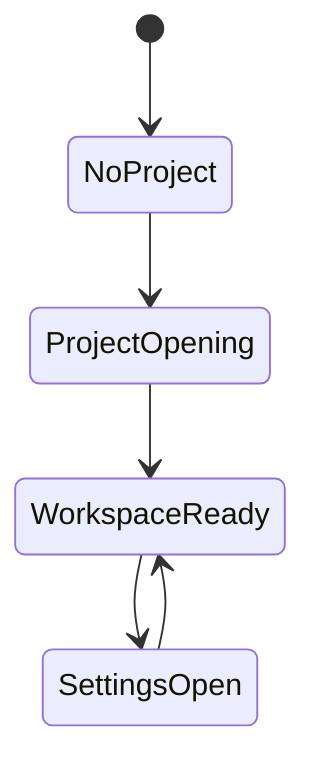
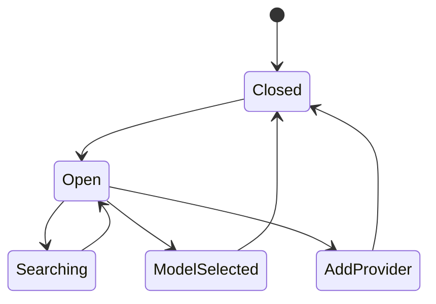
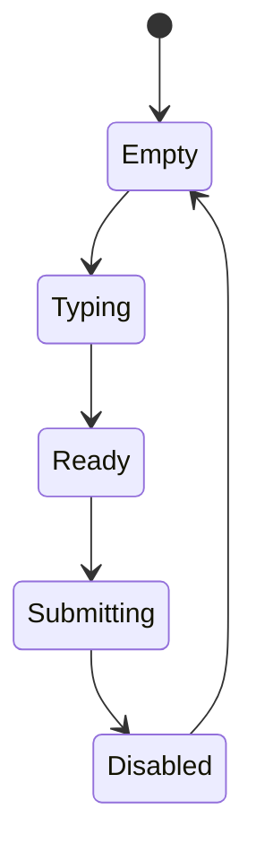
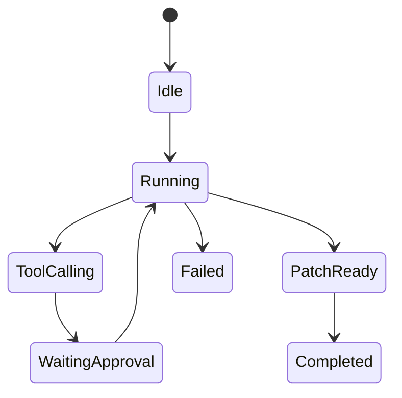
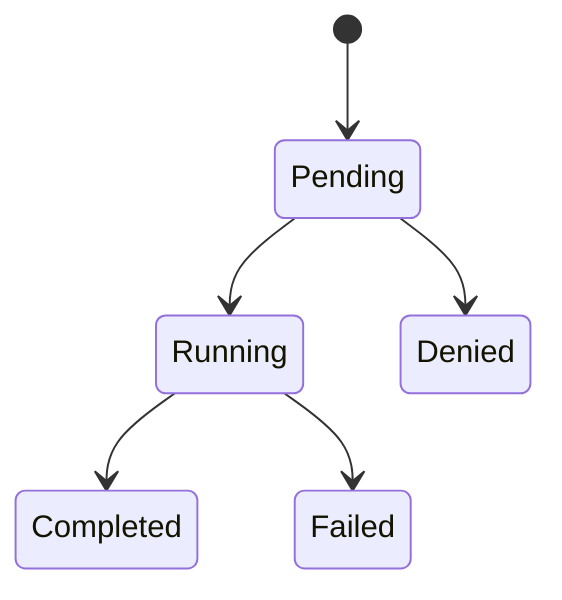
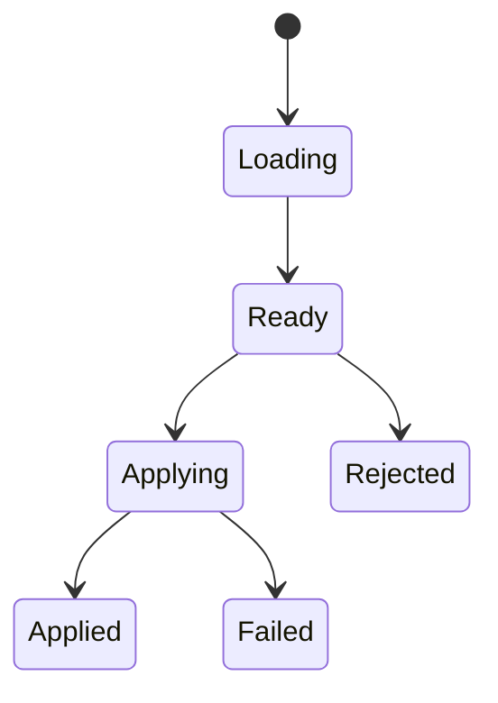
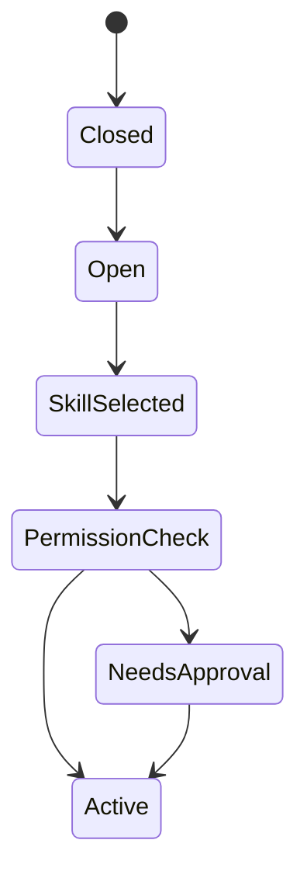

# Qodex Figma Component State Diagram

## Purpose

This document maps UI components to states for Figma and implementation.

---

# Design System

## Theme

Dark-first, fluid glass UI.

## Tokens

```text
Radius:
- sm: 8
- md: 12
- lg: 18
- xl: 24
- full: 999

Spacing:
- 4
- 8
- 12
- 16
- 24
- 32

Typography:
- display
- title
- body
- caption
- code
```

## Color Roles

```text
background.base
background.gradient
surface.glass
surface.elevated
border.subtle
text.primary
text.secondary
accent.blue
accent.violet
accent.cyan
status.success
status.warning
status.danger
```

---

# Page Tree

```text
App
├── WelcomePage
├── WorkspacePage
├── ProviderSettingsPage
├── SkillsPage
├── MCPPage
├── SettingsPage
└── DiffReviewModal
```

---

# Component Hierarchy

```text
AppShell
├── TopBar
├── ProjectRail
├── AgentWorkspace
│   ├── AgentTimeline
│   │   ├── UserMessage
│   │   ├── AgentMessage
│   │   ├── ToolCallCard
│   │   └── PatchCard
│   └── PromptBar
│       ├── SkillQuickInsert
│       ├── ContextPicker
│       ├── ModelSwitcher
│       └── RunButton
└── ContextPanel
    ├── ActiveModelCard
    ├── TokenBudgetCard
    ├── ActiveSkillsCard
    ├── GitStatusCard
    └── PermissionModeCard
```

---

# State Diagrams

## AppShell



States:

- NoProject
- ProjectOpening
- WorkspaceReady
- SettingsOpen
- FatalError

---

## ModelSwitcher



States:

- Closed
- Open
- Searching
- ModelSelected
- AddProvider
- ProviderError

UI requirements:

- Group by provider family
- Show connection status
- Show context window
- Show badge for reasoning/tool support

---

## PromptBar



States:

- Empty
- Typing
- Ready
- Submitting
- Disabled
- Error

---

## AgentTimeline



---

## ToolCallCard



Visual states:

- pending: muted border
- running: animated glow
- completed: green status
- failed: red status
- denied: amber status

---

## DiffViewer



Required controls:

- Apply all
- Apply selected
- Reject
- Copy patch
- Open file

---

## SkillDrawer



---

# Component Specs

## ProjectRail

Props:

```ts
interface ProjectRailProps {
  project?: Project;
  sessions: Session[];
  skills: Skill[];
  activeRoute: string;
}
```

## AgentTimeline

Props:

```ts
interface AgentTimelineProps {
  messages: Message[];
  taskEvents: TaskEvent[];
  patches: Patch[];
}
```

## ModelSwitcher

Props:

```ts
interface ModelSwitcherProps {
  providers: ProviderConfig[];
  models: ModelInfo[];
  activeModelId?: string;
  onSelect(modelId: string): void;
}
```

## DiffViewer

Props:

```ts
interface DiffViewerProps {
  patch: Patch;
  mode: "side-by-side" | "inline";
  onApply(files?: string[]): void;
  onReject(): void;
}
```

---

# MVP UI Acceptance Criteria

- App has Welcome page
- User can open project
- Workspace renders three-column layout
- Model switcher shows providers
- Prompt bar can submit task
- Timeline shows streaming output
- Tool cards show status
- Diff viewer can review patch
- Provider settings can save API key reference
- Skills page lists project skills
