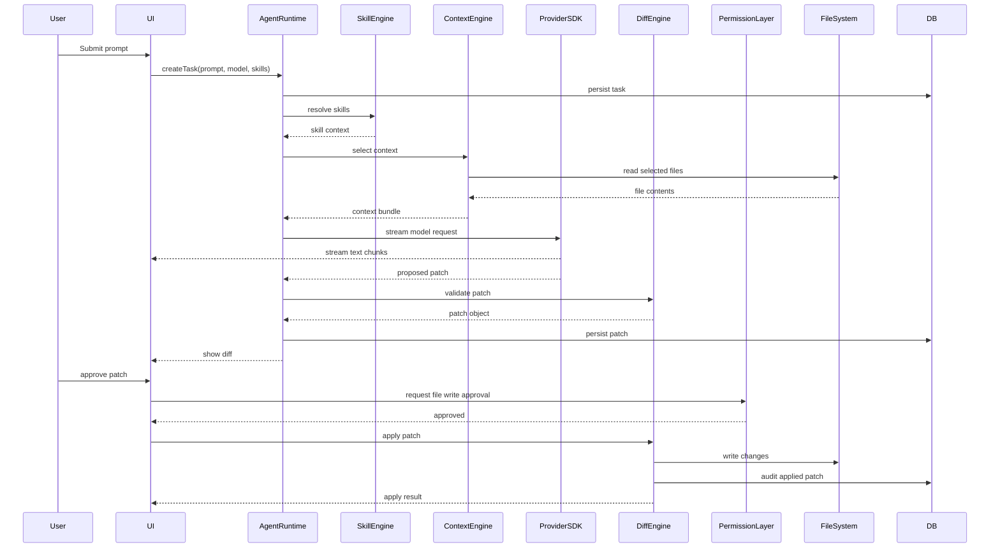
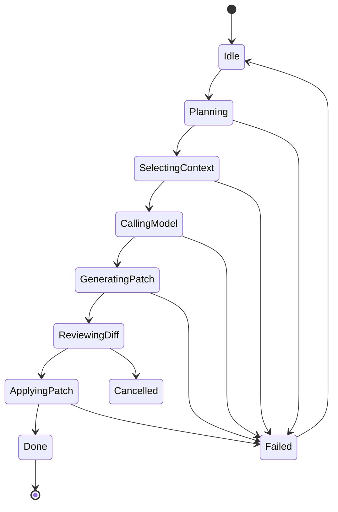
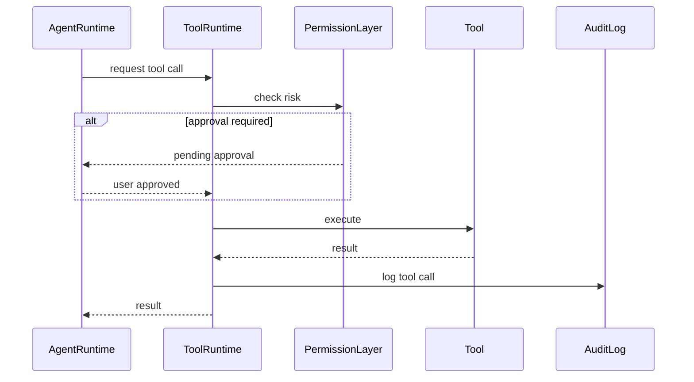
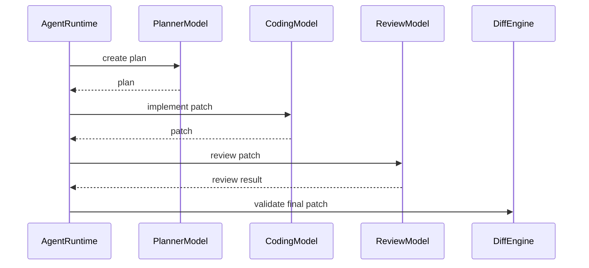

# Agent Runtime Sequence Diagram

## Purpose

This document defines the runtime behavior for Qodex tasks.

---

# MVP Task Sequence



---

# State Machine



---

# Tool Call Sequence



---

# Multi-Model Sequence



---

# Error Recovery

## Model Error

```text
retry once
↓
if fail, show error
↓
allow switch model
↓
resume task
```

## Patch Error

```text
show invalid patch
↓
ask model to regenerate patch
↓
validate again
```

## Permission Denied

```text
mark tool call denied
↓
continue with safe alternative if possible
```
